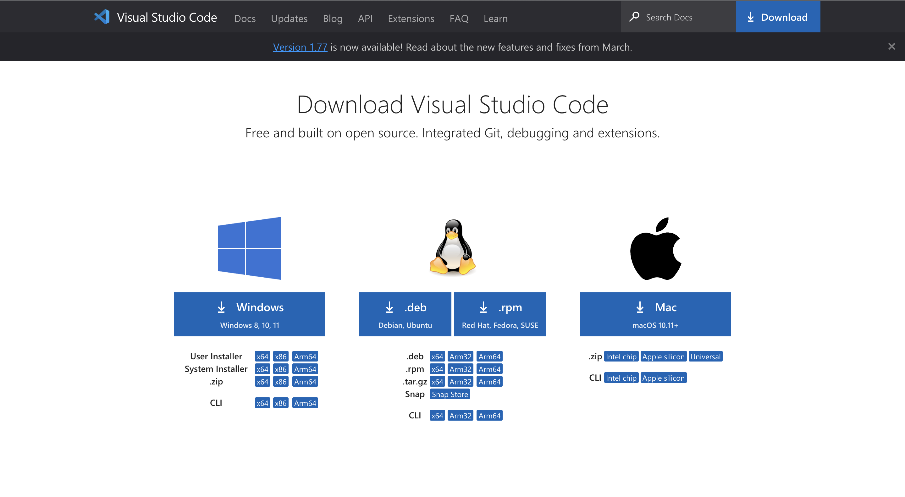
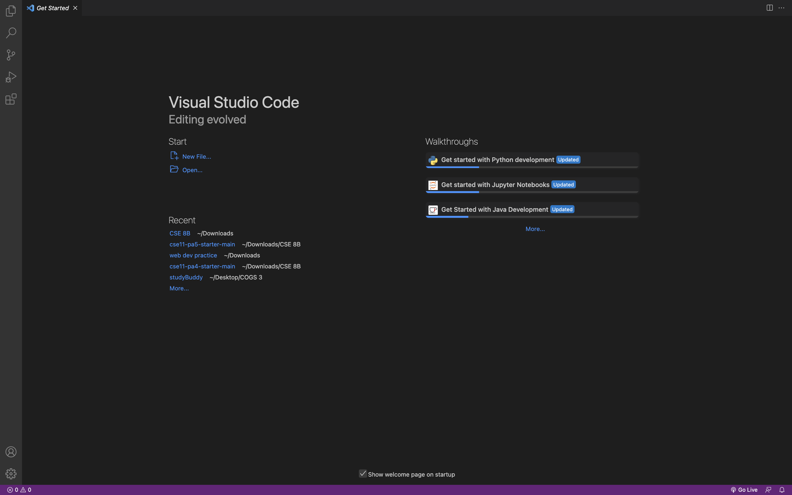
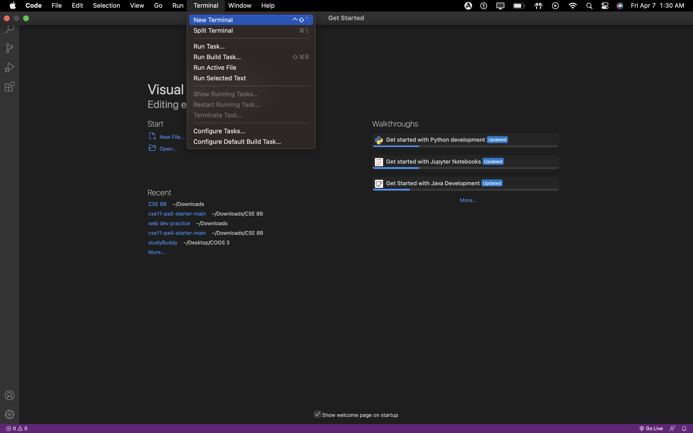
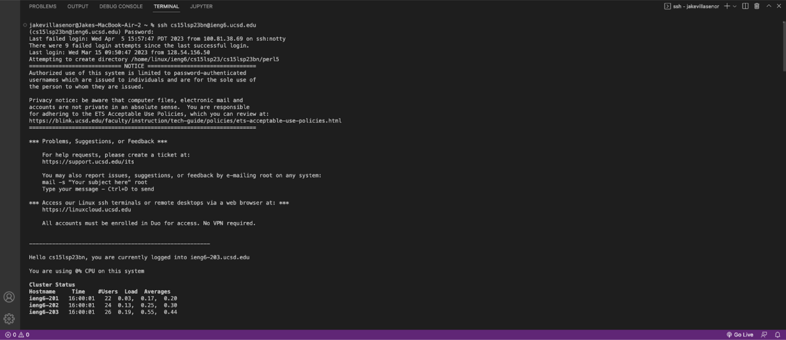
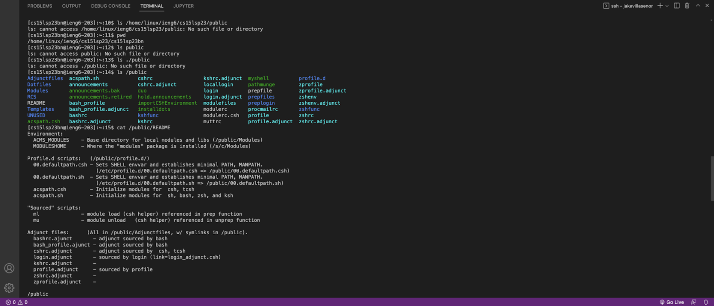

# Lab Report 1 - Remote Access and FileSystem (Week 1)

In this [lab](https://ucsd-cse15l-s23.github.io/week/week1/), we set up our
CSE 15L accounts and ran some commands in a remotely connected VScode terminal.

## Step 1: Installing VScode

Visual Studio Code, commonly referred to as "VScode," is a text-editor that allows a
user to create and run programs in a variety of languages. For the purposes of CSE 15L,
we will primarily be using Java. To install VScode, visit [this](https://code.visualstudio.com/download)
website and download the version for your device.

In my case, I have prior experience working with VScode, so I did not need to go 
through the installation process. VScode has many extensions you can add, but we will not
be covering those for the purposes of this lab report. Once you download and open VScode,
your screen should look something like this:

For this lab, we only worked with the terminal. To open the terminal on Mac, hover your mouse
up to the navigation bar at the top left corner of the screen, and click "Window." Then, select 
"New Window." It should look something like this:

Once you open a new terminal, you're ready to move onto Step 2!

## Step 2: Remotely Connecting

In this step, we connected to a remote server using our CSE 15L accounts. To do this,
logged into the remote server using the `ssh` command followed by our course-specific
account. The command-line looked something like this:

`$ ssh cs15lsp23bn@ieng6.ucsd.edu`

Once we typed this, we were prompted to provide the password for the account. Once logged on,
the terminal produced a message that looked something like this:

After setting this up, our terminals are connected to a computer in the CSE basement.
Any commands we run on our own computers, known as the *client*, will run on that computer,
known as the *server*. Now, we can move onto Step 3!

## Step 3: Trying Some Commands

In this step, we were mostly concerned with trying out commands to explore our remote
server. A few commands that were provided on the lab instructions include:

* `cd <path>` - "**change directory**." This command is used to switch the current working 
directory to a given path. (*CSE 15L Lecture 2*)
* `ls <path>` - "**list**." This command is used to list the files and folders in the given 
path. (*CSE 15L Lecture 2*)
* `cat <path1> <path...>` - This command prints the contents of one or more files given by 
the paths. (*CSE 15L Lecture 2*)
* `cp <path1> <path...>` - This command copies the files or directories given by the paths.
(*[Source](https://people.computing.clemson.edu/~yfeaste/cpsc101/CPSC101F15Yvon/Homework/1010_Presentation/MV%20and%20CP.pdf)*)

I tried a couple of commands, but the one that stood out to me the most was the `ls` and `cat` 
commands. Here is a screenshot of my terminal:

As you can observe, I used the `ls` command followed by the directory
`/home/linux/ieng6/cs15lsp23/public`, and it printed that there was no such file or directory.
At first, I was confused by this. To check the working directory, we can use the `pwd` command.

* `pwd` - "**Print working directory**." This command is used to display the current working directory.
(*CSE 15L Lecture 2*)

By using this command, I was able to figure out where in the directory I was. From there,
I used the `ls` command on the public directory to see which files I could read using the `cat`
command. In this example, I printed the contents of the **README** file.

--- 

Thanks for reading! :)
