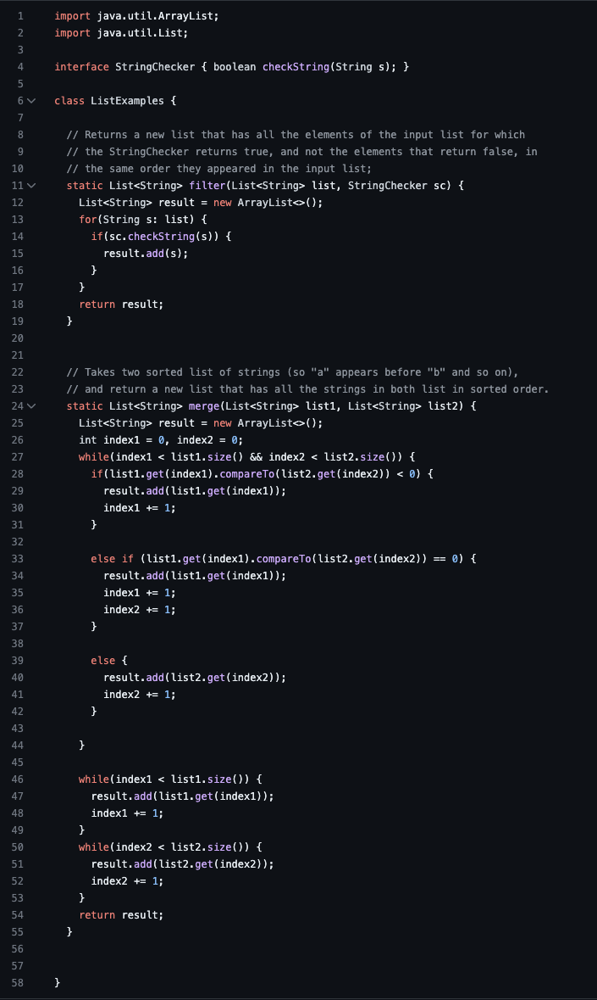

# Lab Report 5 - Debugging and Reflection (Week 9)

In this [lab](https://ucsd-cse15l-s23.github.io/week/week9/), we designed a debugging scenario in which we wrote a mock-post as a student on EdStem and responded to it as a TA would. At the end, we wrote a reflection about the things we learned this quarter.

## Part 1 - Debugging

Here is the post of a student that is having an issue with failure-inducing input:


For reference, here are the images attached to the student's post.




Here is what a TA might respond to this student:

"It seems that there might be an issue with your merge method. In the case that the `index1` in `list 1` and `index2` in `list 2` are equal, what happens to the indeces? Should we increment one of them, or both of them? Take a close look at what you are adding to the `result` ArrayList and what indeces you are incrementing."

After the student takes into account what the TA responded, they look closely at their merge method and identify the code that was causing the test to fail. Here is what they attached in response to the TA's reply:


"I found the bug, thank you!"

In this case, the bug was that `index2` was being incremented when only `index1` was being added to the `result`. As a result, it skips over some elements in the `list2` in the case that `index1` and `index2` are identical.

### Overview of Information

- The file & directory structure needed
    ```
    -grader-skill-demo2
    ---GradeServer.java  
    ---Server.java
    ---TestListExamples.java
    ---grade.sh
    ---lib
    -----hamcrest-core-1.3.jar
    -----junit-4.13.2.jar
    ```
    
- The contents of each file before fixing the bug


 
- The full command line ran to trigger the bug

```bash grade.sh https://github.com/jakev220/list-examples-dupl```

- A description of what to edit to fix the bug

In the `else if` statement in the first while loop in the `merge` method, `index2` is incremented when the index of `list1` is equal to the index of `list2`. When they are equal, only `index1` is added to the list, but both indeces are incremented. To fix this, delete or comment out the incremented `index2`.
